# Proyecto Card Validation "Tienda Amanito Papelería"

## Índice

* [1. Resumen del proyecto](#1-resumen-del-proyecto)
* [2. Preparando el entorno de desarrollo](#2-preparando-el-entorno-de-desarrollo)
* [3. Escogiendo el proyecto](#3-escogiendo-el-proyecto)
* [4. El Usuario](#4-el-usuario)
* [5. Prototipado de baja fidelidad](#5-prototipado-de-baja-fidelidad)
* [6. Prototipado de alta fidelidad](#6-prototipado-de-alta-fidelidad)
* [7. Codeando](#7-codeando)
* [8. Principales bloqueos mientras codeaba](#8-principales-bloqueos-mientras-codeaba)

***

## 1. Resumen del proyecto

Validación de medio de pago en página de venta de artículos de papelería.

[Link a hacia mi Demo] (https://majo-cerpe.github.io/SCL017-card-validation/)

## 2. Preparando el entorno de desarrollo

Antes siquiera de empezar a pensar en que proyecto iba trabajar tuve que instalar todos los programas necesarios para empezar a codear. Este proceso fue bastante frustrante porque la verdad es que en un principio no sabía la utilidad de cada herramienta y por lo mismo no sabía de que manera configurar la instalación de cada una. Para hacer funcionar adecuadamente todo el entorno tuve que ver varios videos e instalar algunas herramientas en más de una oportunidad.

## 3. Escogiendo el proyecto

Opté por realizar el proyecto Card Validation, principalmente porque le ví una utilidad más práctica, pues en los sitios web de venta siempre hay que validar el formato de ciertos tipos de datos que son ingresados por el usuario y si bien le veo la utilidad pedagógica la proyecto cipher me costaba más imaginarlo siendo utilizado en algún contexto real, principalmente porque la herramienta de cifrado a construir era muy sencilla y hoy existen variados algoritmos de cifrado mucho más seguros.

## 4. El usuario

Decidí hacer una validación de tarjeta de crédito para una página de venta de artículos de librería. La decisión de la temática estuvo basada principalmente en los intereses de los potenciales usuarios, en este caso, debido a la pandemia, las personas que tengo más cerca: mis hermanas.
Antes de hacer en papel mi primer prototipo conversé con mis potenciales usuarios y, además, miré varios ejemplos de páginas web de venta de todo tipo de productos.

## 5. Prototipado de baja fidelidad

Cuando ya tuve una idea general de los alcances que iba a tener mi proyecto, hice mi primer layout en papel:

### Prototipo 1

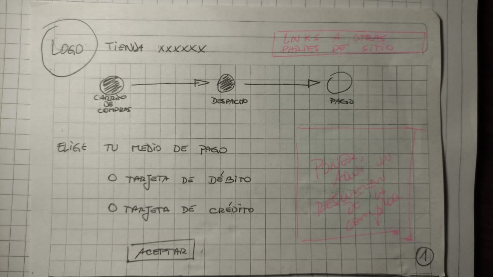
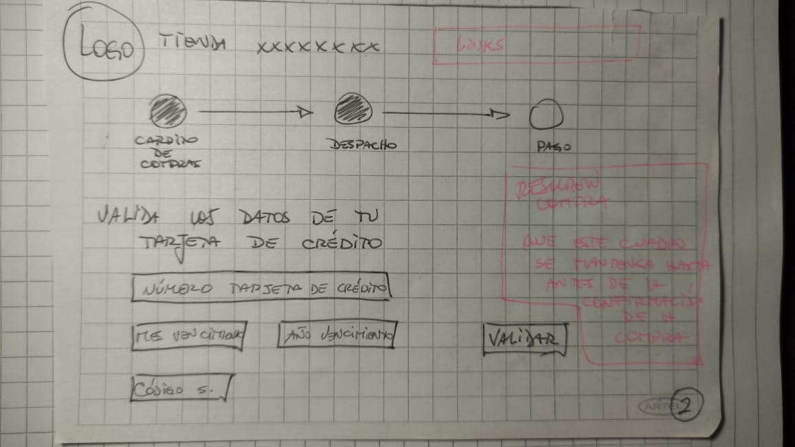
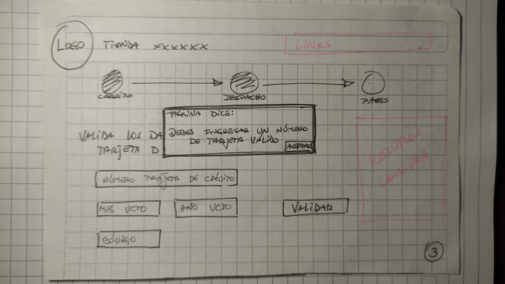
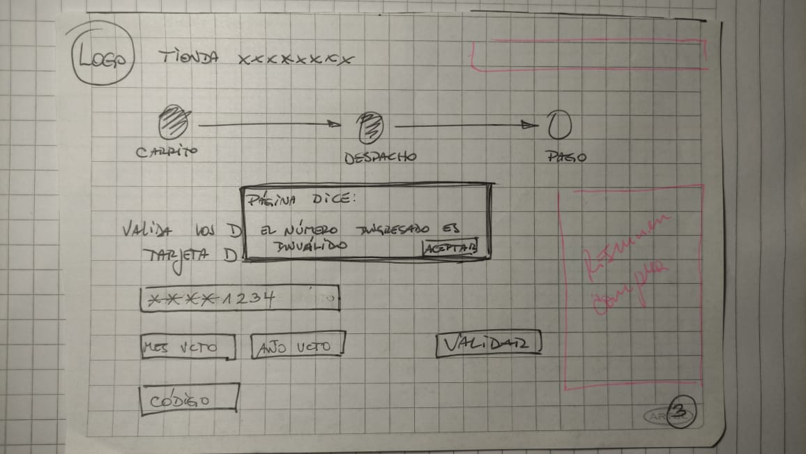
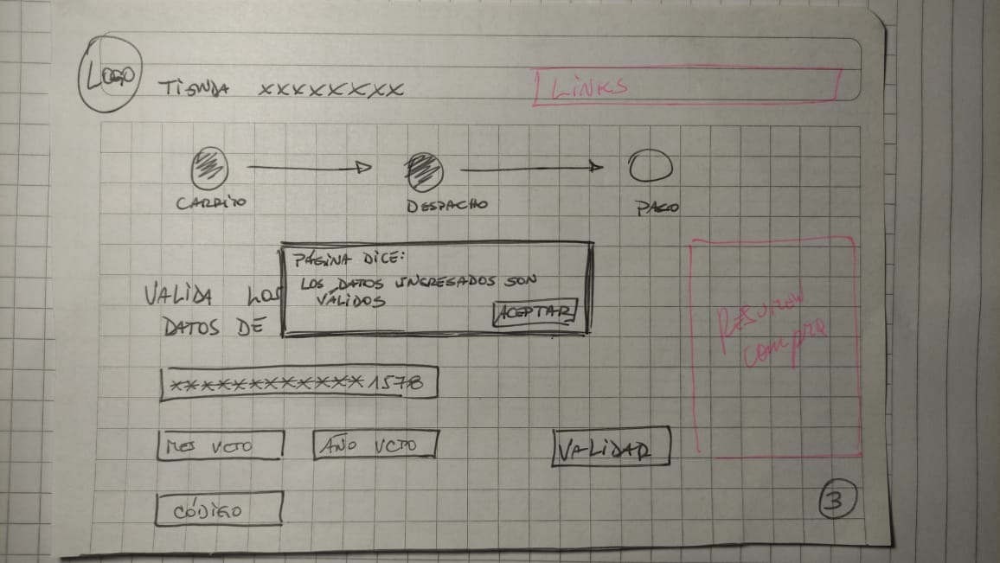
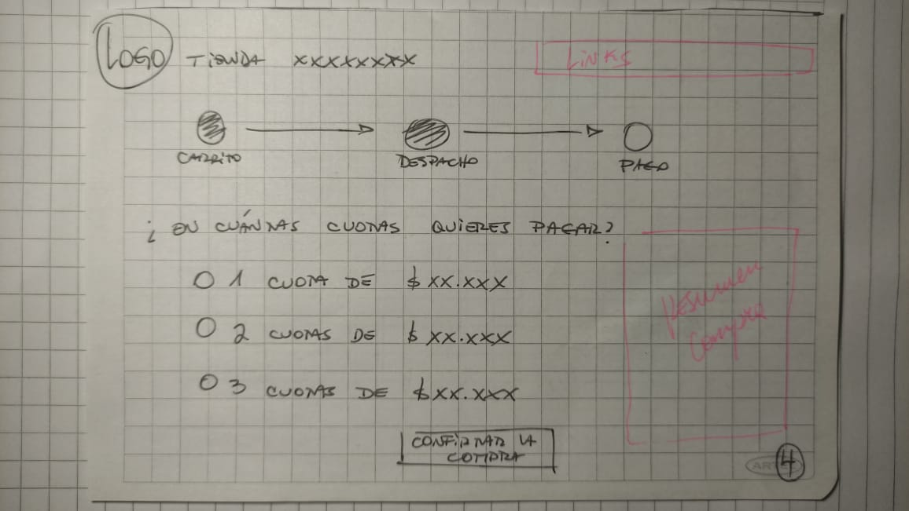
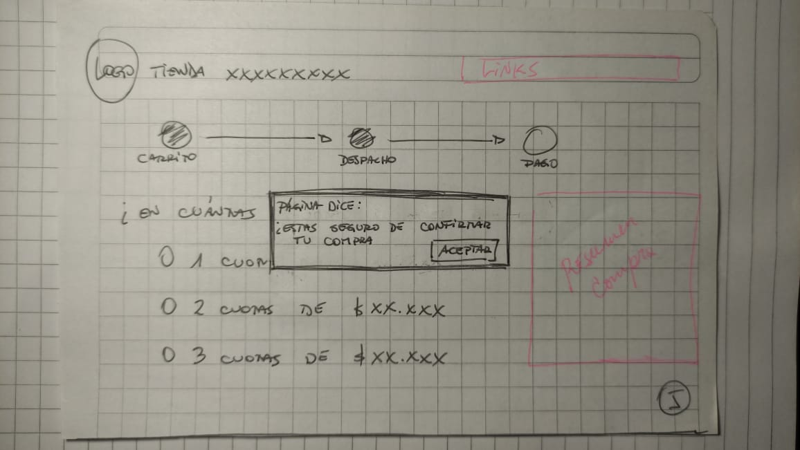
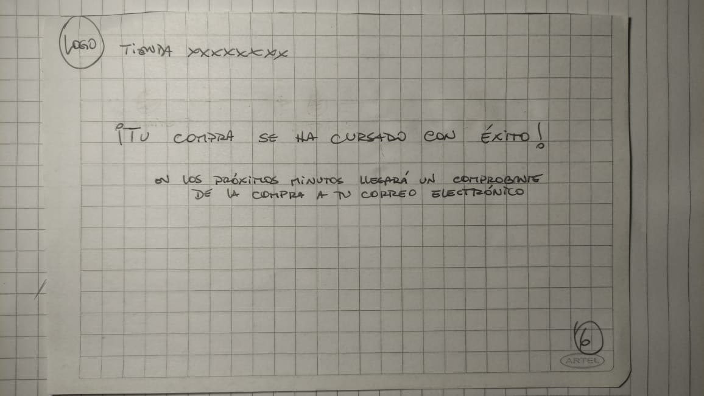

Luego probé mis prototipos en papel con las dos potenciales usuarias y sobre la base de esas pruebas y las sugerencias realizadas desarrollé mi prototipo para llevar a producción.

Las principales sugerencias a este primer prototipo fueron:
- Visualización durante todo el proceso de pago de un resumen de la compra.
- Links a otras partes del sitio web en la parte superior de la página para dar un look más realista (aun cuando estos links no llevaran a ninguna parte).
- Que el layout estuviera basado en productos de papelería.

### Prototipo 2

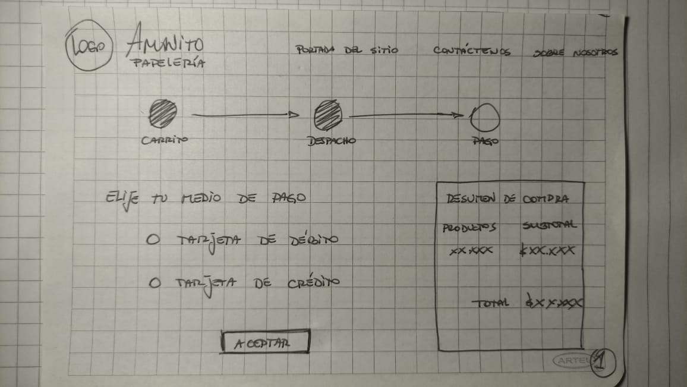
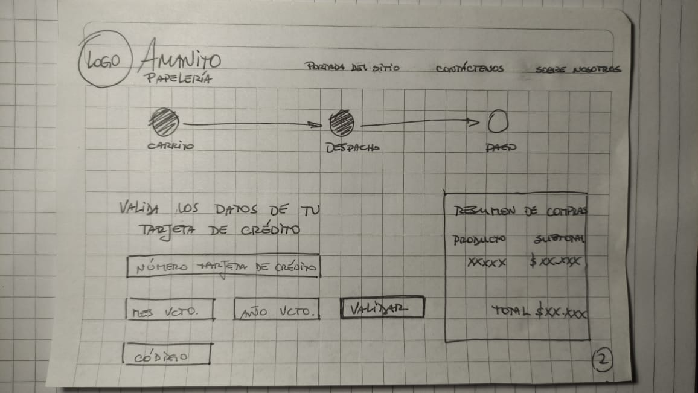
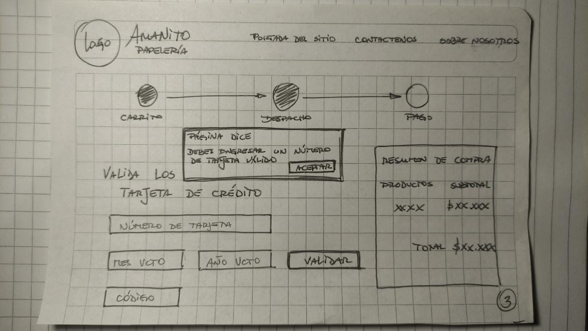
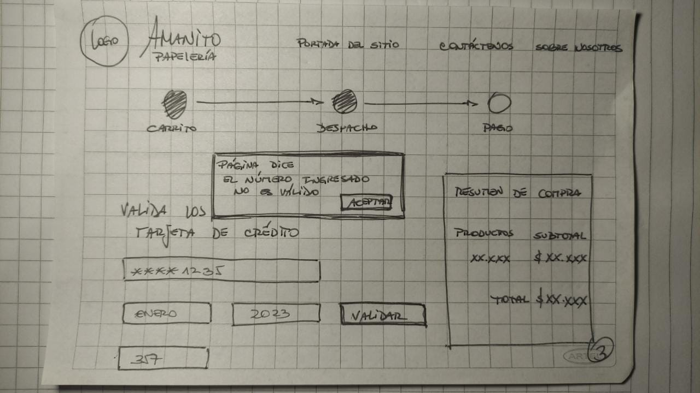
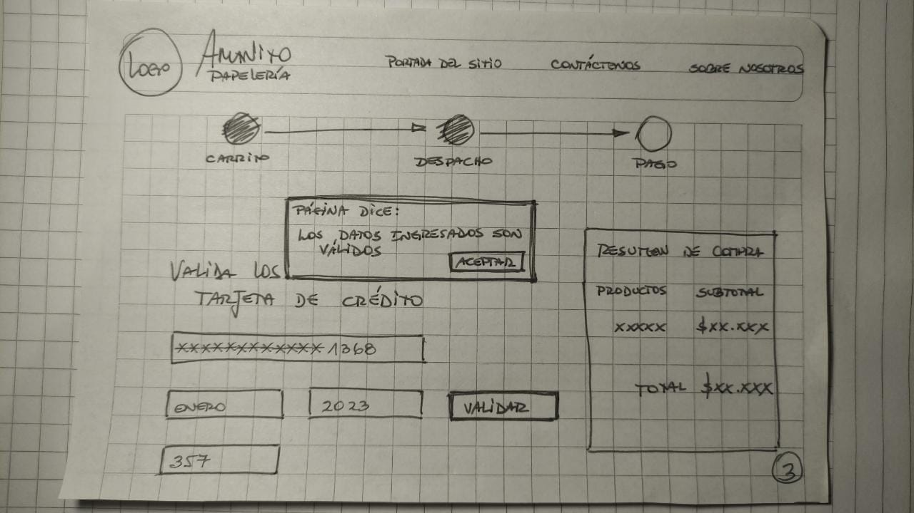
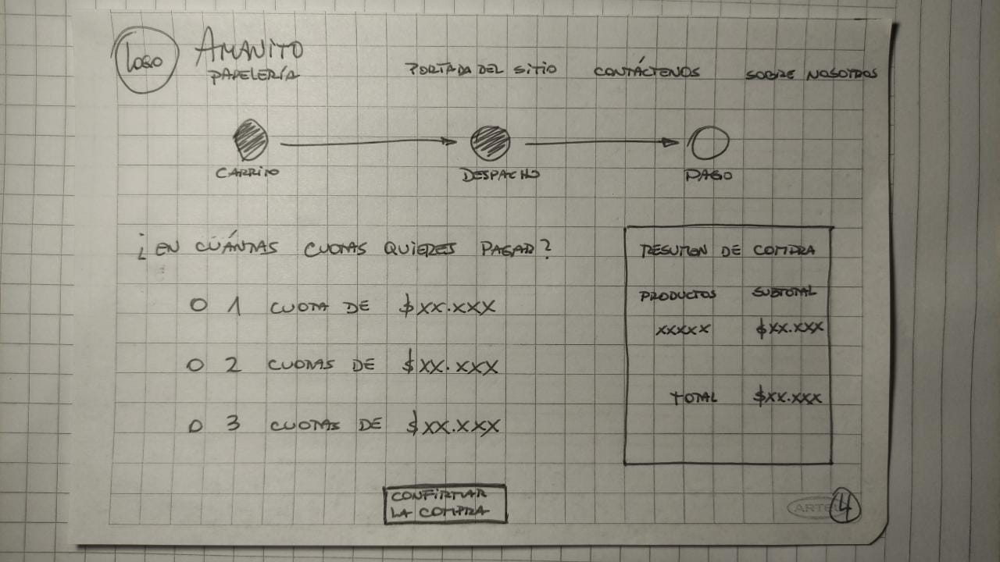
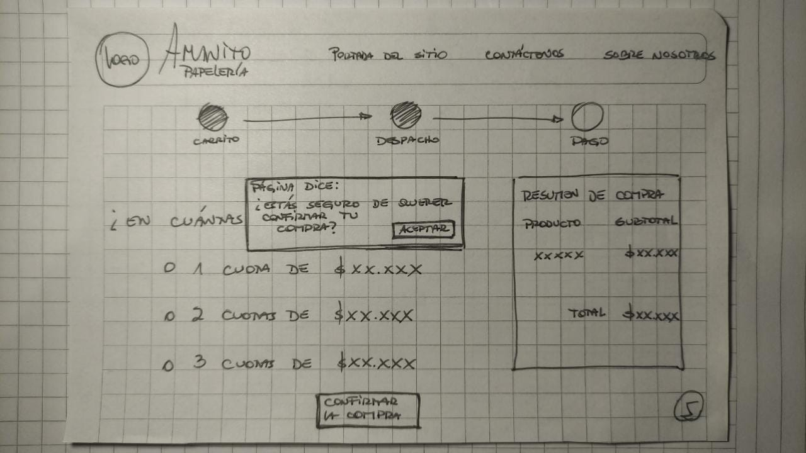
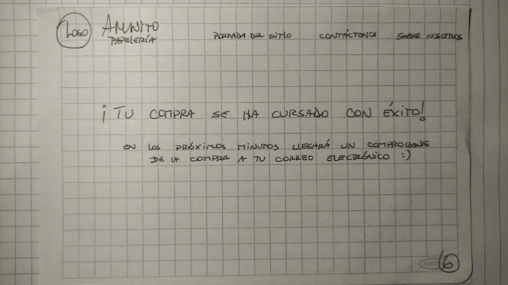

Este Segundo prototipo también fue probado con los usuarios los cuales manifestaron conformidad con la solución dada a sus sugerencias.

## 6. Prototipado de alta fidelidad

En virtud del tiempo que me había tomado preparar el entorno de trabajo y leer sobre algunos temas para empezar codear, decidí no hacer un prototipo de alta fidelidad y empezar a codear sobre la base de mi prototipo en papel. Mirando en retrospectiva creo que fue una mala decisión porque, posteriormente, cuando estaba desarrollando el layout de la página directo el en código, el proceso fue mucho más largo de lo que probablemente habría sido si hubiese tenido un prototipo de alta fidelidad que seguir. Siento que el tiempo que me ahorré en un principio, saltándome esa etapa, se vio duplicado luego en el desarrollo; en síntesis, la decisión no fue nada eficiente y por lo mismo es uno de los aprendizajes que tengo que plasmar en los próximos proyectos.

## 7. Codeando

Comencé dando estructura en HTML a la parte de la página que tendría el input donde el usuario introduciría los números de su tarjeta de crédito. Una vez que tuve eso traté de desarrollar una función de prueba (con un alert) en el archivo /index.js. pero esta obviamente no funcionó debido a que el boilerplate entregado estaba hecho para trabajar con módulos. Debido a lo anterior tuve que estudiar sobre sintaxis de módulos en Javascrip. Una vez que logré correr mi función de prueba como método de propiedad del objeto “validator” comencé a desarrollar la función “isValid” proceso que, en general, fue bastante fluido y son mayores bloqueos.

Cuando tuve lista la función “isValid” y esta era llamada adecuadamente desde el /index.js. me dispuse a construir la función maskify que fue donde tuve más problemas, principalmente porque mi primer intento de función cambiaba el valor que había sido ingresado por el usuario al input (cambiaba algunos dígitos por asteriscos).

## 8. Principales bloqueos mientras codeaba

1. Tomar dígitos ingresados en el input del número de tarjeta de crédito en un array.
2. Entender funcionamiento de módulos en Javascript.
3. Cómo desarrollar la función “maskify” sin alterar los valores ingresados al input (porque posteriormente los necesitaba para ejecutar la función “isValid”)
4. Cómo guardar los valores ingresados el input en otra variable antes que la función “maskify” los modifique y que esta nueva variable sea accesible desde la función “isValid” (Variable Global)
5. Como borrar números desde el input y que estos también se borren del array creado para guardarlos antes de que sean modificados por la función “maskify”.
